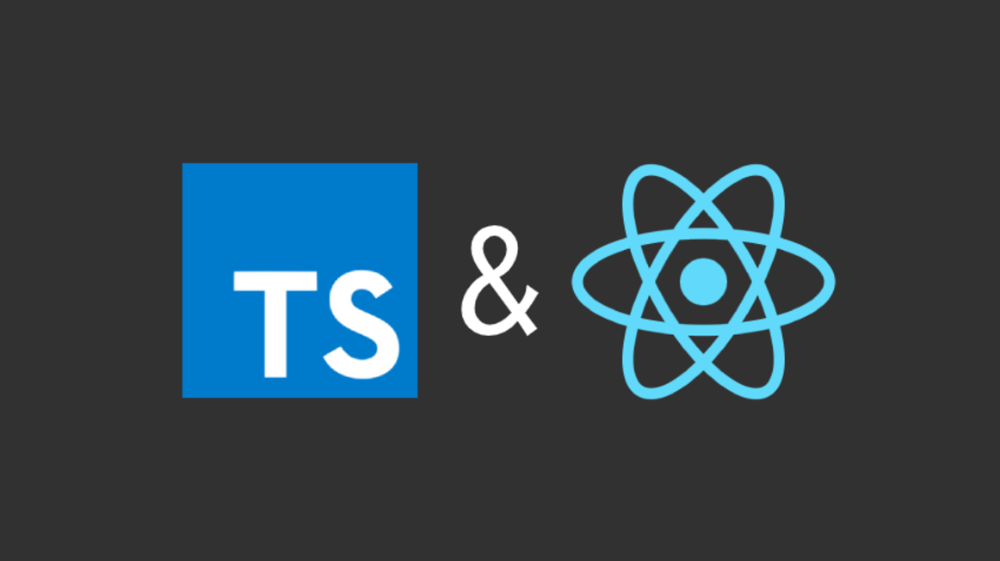

## ReactJS에 TypeScript 적용시켜보기

    

본 Repository는 ReactJS 프로젝트에 TypeScript를 적용해보는 연습을 하기 위한 저장소입니다.

학습한 내용은 개인 개발 블로그에 업데이트하였습니다.

**개인 개발 블로그** : [https://leehyungi0622.github.io/categories/ReactJS-TypeScript/](https://leehyungi0622.github.io/categories/ReactJS-TypeScript/)
